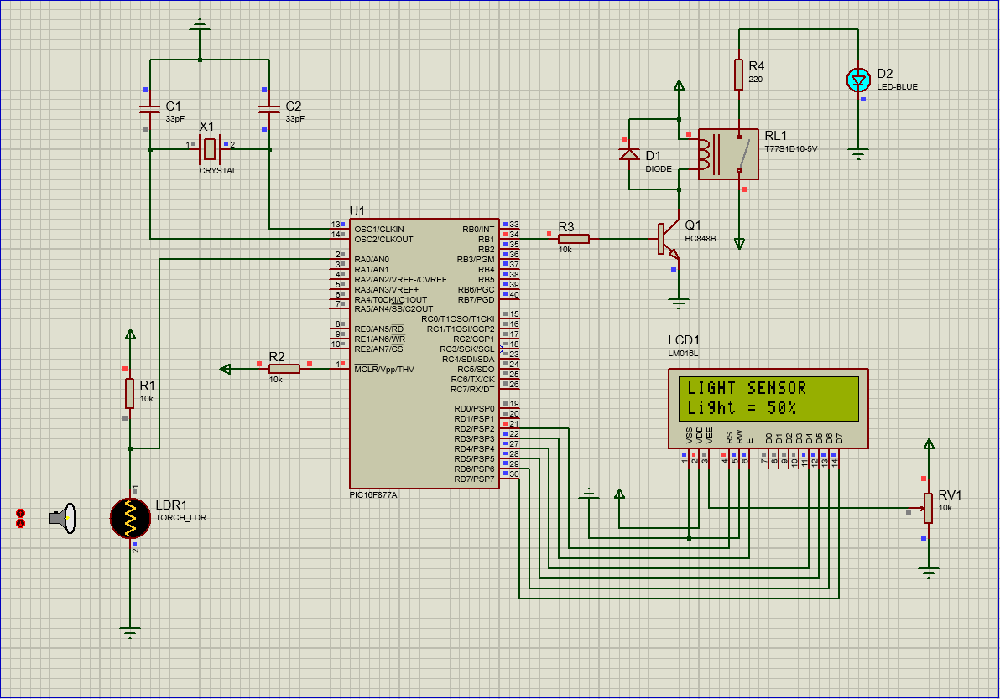
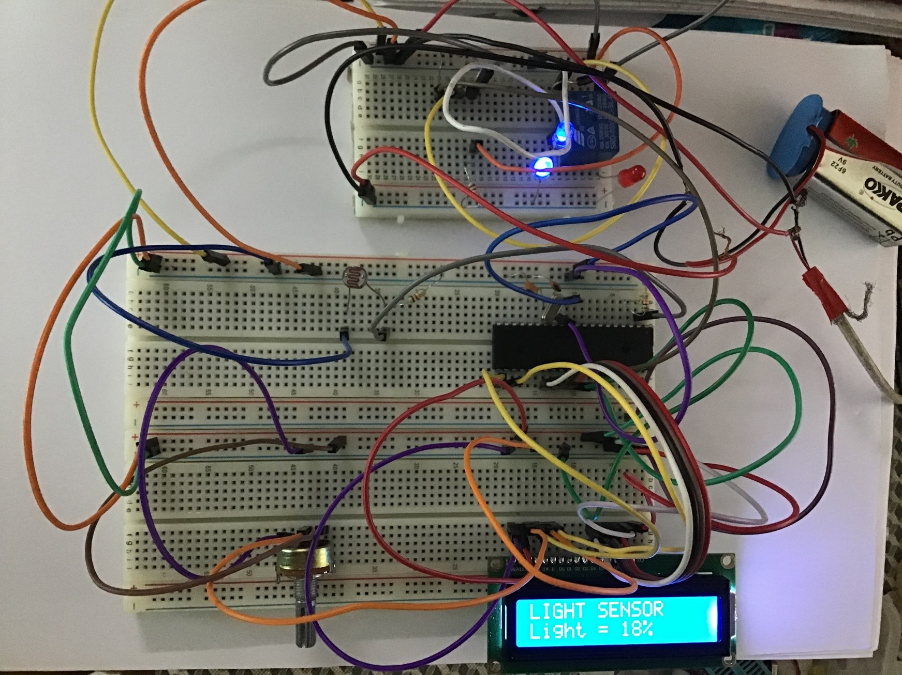

# Automatic Light System using PIC Microcontroller

## Course : CSE 331 

**Objective :**

This project aims to design an inexpensive automatic lighting system so that no manual or physical input is necessary. The circuit will detect the amount of surrounding light, and based on that; it will turn on/off the lights. It will also display the surrounding light percentage. 

**Components :**

•	PIC16F877A Microcontroller\
•	LDR\
•	16x2 LCD Display\
•	LED\
•	Jumper Wire\
•	10k Ohm Resistor\
•	10k ohm  Potentiometer\
•	33pF Ceramic Capacitor\
•	5V Relay\
•	Breadboard\
•	8MHz Crystal Oscillator\
•	Diode\
•	Transistor\
•	Battery\
•	PICkit 3\
•	PIC Programming Adapter

**Software Used :**

•	Simulation (Proteus)\
•	Coding (MikroC)

---

**Simulation Design :**

**Procedure :**

For this project we selected PIC16F877A microcontroller. The program for the project was written in C language in MikroC IDE. All the necessary libraries were included for the program. In the program we defined the ports and pins that are to be connected with LCD display and LED outputs. We used PORT A to take input from the sensor and PORT D to display the LCD and PORT B was used to show the output LED. We set the desired light percentage to 65% for turning on/off the light. The program was then built and hex file was generated. We used Proteus for the simulation of the circuit. We connected pin 1 of the microcontroller with a 10K resistor to the power which works as a pull up resistor. We used an LDR and connected it in series with a standard resistor across a DC power supply voltage and a voltage divider network is made that can generate different voltages. Here Vout = Vin x R1/(RLDR + R1).\
Vout is connected with pin 2 of the microcontroller as input. When light falls on the LDR the resistance is increased and Vout decreases and when the amount of light decreases, the LDR the resistance decreases and Vout is increased. The value of Vout is used to determine the percentage of light.  An 8MHz oscillator was connected with pin 13 and 14 of the microcontroller and two 33pF capacitors were connected with the oscillator that connects to the ground. Using the pin diagram of the 16x2 LCD display the LCD was connected to PORT D of the microcontroller. We connected pin 1 of PORT B to the LED. We used a 5V relay in the circuit which is used as a switch. When the relay receives 5V it turns on the switch which completes the LED circuit and the LED turns on. The relay is used to switch on high powered devices by using the low power of the microcontroller.\
5V voltage was supplied to all of the necessary components to power the circuit. We loaded the hex file that was generated using MikroC in the microcontroller in Proteus. We then simulated the circuit. The LCD display shows the light percentage and if the light percentage goes below 65% then the LED is turned on and if it is 65% or above the LED will turn off. After that we used PicKit3 and PIC Program Adapter to connect with the PIC16F877A microcontroller and burned the hex file. Using the pin diagram of PIC16F877A we implemented the simulated circuit in the hardware.

**Image of hardware Implementation :**

**Contribution :**
1. [Samiya Kabir Youme](https://github.com/Youme01)
2. [Hossain Ahamed](https://github.com/ALVI0017)
3. [Rusafa Binte Sohrawardi](https://github.com/)
